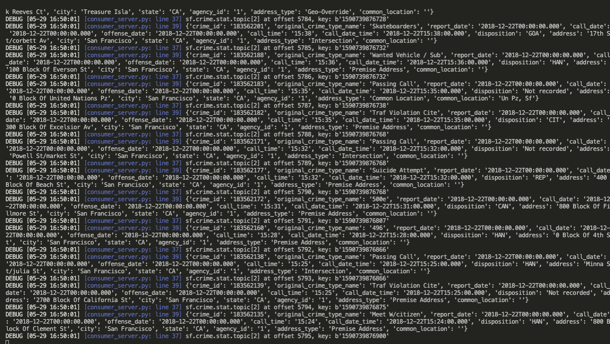
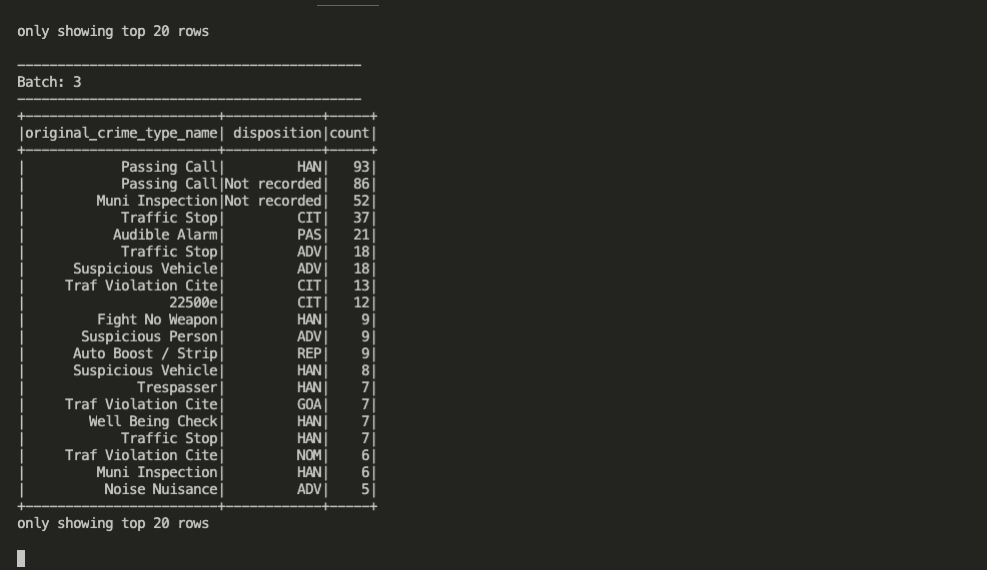
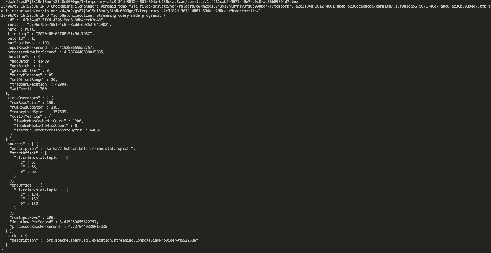
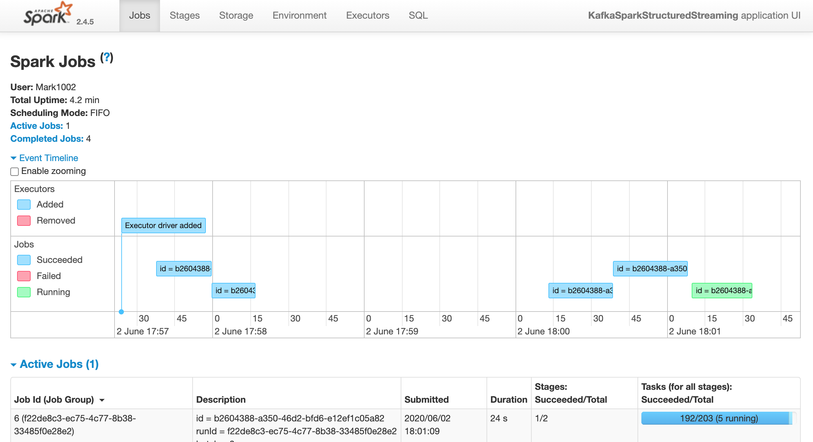
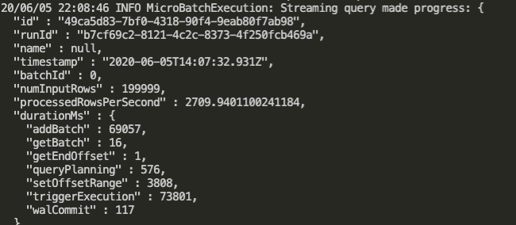

# sf-crime-statistics-spark-streaming
## step 1
Start up kafka server by docker-swarm.
```
$ docker stack deploy -c=kafka-docker.yml udacity-kafka
```
Execute `kafka_server.py` to produce records to the topic.
```
$ python kafka_server.py
```
Execute `consumer_server.py` to see the consumed records printed in console.
```
python consumer_server.py
```
Below picture is the screenshot of kafka-consumer-console output. 


## step 2
Execute `data_stream.py` to see streaming results.
```
$ python data_stream.py
```
The screenshot of the streaming output.


The screenshot of the progress reporter.


Because of the reason that the new spark structured streaming API doesn't support the streaming monitoring. (https://knowledge.udacity.com/questions/158733), So, the spark web UI don't show the streaming tab.


## step 3
1. How did changing values on the SparkSession property parameters affect the throughput and latency of the data?

    We can adjust the parameter `maxOffsetsPerTrigger` to specified more total number of offsets processed per trigger interval.
    By changing the value of `maxOffsetsPerTrigger`, we can find that the progress report's attribute, `processedRowsPerSecond`, will also change.
    
2. What were the 2-3 most efficient SparkSession property key/value pairs? Through testing multiple variations on values, how can you tell these were the most optimal?

    In my tuning `maxOffsetsPerTrigger` experiment, I find that set `maxOffsetsPerTrigger` to 300,000 has the most optimal effect. the value of `processedRowsPerSecond` is up to 2709, comare to the beginning only 200 at `maxOffsetsPerTrigger` and 4 at `processedRowsPerSecond`. I find that the optimal setting is very depend on the host machine performance and incoming data size. if `maxOffsetsPerTrigger` is too small relative to incoming data size, then it need to trigger more batch to coming up with the newest data. if  set `maxOffsetsPerTrigger` to bigger value, it may have less  batch to coming up with the newest data, but  may also have more trigger time to process the batch data. it is very depend on spark's cluster machine performance.

    
